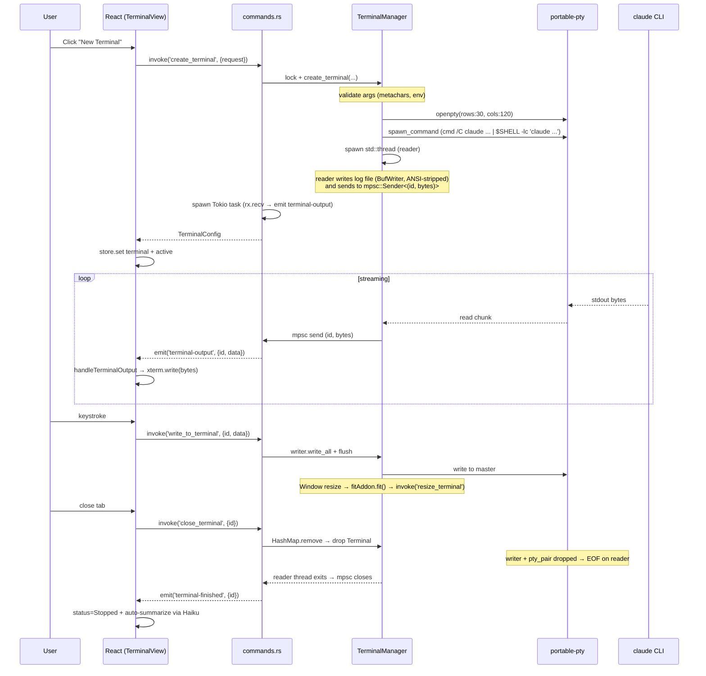
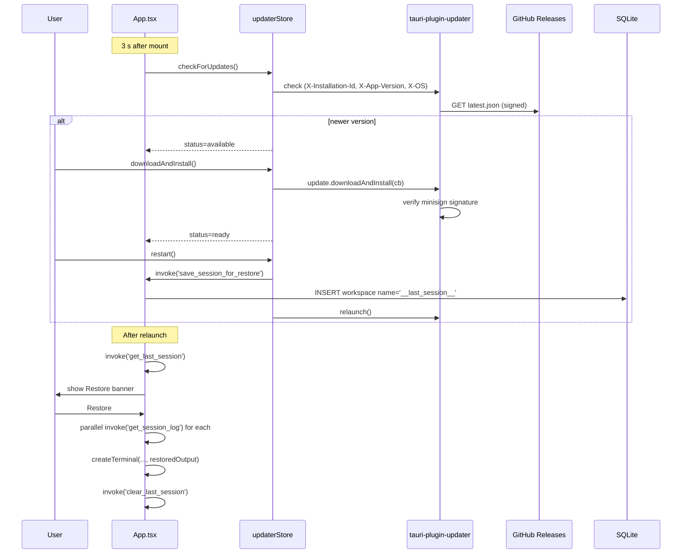

# Codebase Map

> Auto-generated by Cartographer. Last mapped: 2026-05-06.

ClaudeTerminal is a Tauri 2.x desktop app (Rust backend + React 18/TS frontend) that manages multiple parallel Claude Code CLI sessions in tabbed and grid views with PTY-based terminal emulation. Current version: **1.20.7**.

## System Overview

```mermaid
graph TB
    subgraph "Frontend (React + Vite)"
        App[App.tsx<br/>bootstrap + event router]
        TitleBar[TitleBar]
        Sidebar[Sidebar]
        Tabs[TerminalTabs]
        Grid[TerminalGrid]
        Split[SplitView]
        TV[TerminalView<br/>xterm.js host]
        FCP[FileChangesPanel<br/>git ops]
        Modals[Modals: NewTerminal,<br/>Profile, Settings,<br/>Workspace, Worktree, ...]
        AS[(appStore<br/>Zustand persisted)]
        TS[(terminalStore<br/>ephemeral Map)]
        US[(updaterStore)]
        ToastS[(toastStore)]
    end

    subgraph "Backend (Rust + Tauri)"
        Cmds[commands.rs<br/>~85 #[command] handlers]
        TermMgr[terminal.rs<br/>TerminalManager + PTY]
        DB[(database.rs<br/>SQLite WAL)]
        Cfg[config.rs<br/>profiles + hints]
        Tel[telemetry.rs<br/>heartbeat]
    end

    subgraph "Native"
        PTY[portable-pty]
        SQLite[(claudeterminal.db)]
        Notify[notify-rust]
        FS[~/.claude/<br/>settings,agents,memory]
        Git[git CLI]
        Claude[claude CLI]
    end

    subgraph "Cloudflare Worker (ct-analytics)"
        WK[index.ts<br/>routes]
        D1[(D1: daily_stats,<br/>daily_dau, counters)]
        KV[(KV: seen, live, rl)]
    end

    subgraph "GitHub"
        GH[Releases<br/>latest.json]
        CI[release.yml]
    end

    App --> AS
    App --> TS
    App --> US
    App -- listen 'terminal-output' --> Cmds
    Tabs --> TV
    Grid --> TV
    Split --> TV
    TV -- invoke write/resize --> Cmds
    FCP -- invoke git_* --> Cmds
    Modals -- invoke --> Cmds
    Cmds --> TermMgr
    Cmds --> DB
    Cmds --> Cfg
    Cmds --> Tel
    TermMgr --> PTY
    PTY --> Claude
    DB --> SQLite
    Cmds --> Notify
    Cmds --> FS
    Cmds --> Git
    Tel -- POST /heartbeat --> WK
    US -- check() --> GH
    WK --> D1
    WK --> KV
    CI --> GH
```

## Directory Structure

```
claude-terminal/
├── src/                          React 18 + TypeScript frontend
│   ├── App.tsx                   Root: setup gate, event listeners, layout, restore banner
│   ├── main.tsx                  React entry (StrictMode + ErrorBoundary)
│   ├── index.css                 Tailwind base + IntelliJ elevation tokens
│   ├── changelog.json            ChangelogEntry[] consumed by WhatsNewModal
│   ├── components/               36 React components (see Module Guide)
│   │   └── monacoSetup.ts        Monaco workers, package.json CodeLens
│   ├── store/                    Zustand stores
│   │   ├── appStore.ts           UI state, persisted (15 fields)
│   │   ├── terminalStore.ts      Terminal Map + xterm refs (ephemeral)
│   │   ├── updaterStore.ts       Auto-updater state machine
│   │   └── toastStore.ts         Notifications (5 max)
│   ├── hooks/
│   │   ├── useKeyboardShortcuts.ts  Global shortcut router
│   │   └── useNotification.ts       OS notifications
│   ├── utils/
│   │   ├── fileIcons.ts             material-icon-theme glob lookup
│   │   ├── diffParser.ts            unified diff → DiffHunk[]
│   │   ├── animations.ts            framer-motion presets
│   │   └── dragDrop.ts              terminal-tab drag MIME helpers
│   └── types/git.ts                 WorktreeInfo / WorktreeDetectResult
├── src-tauri/                    Rust backend
│   ├── src/
│   │   ├── main.rs               Tauri setup, plugin registration, CloseRequested
│   │   ├── commands.rs           ~85 #[command] handlers (all IPC)
│   │   ├── terminal.rs           TerminalManager — PTY lifecycle
│   │   ├── database.rs           SQLite (rusqlite bundled, WAL)
│   │   ├── config.rs             ConfigProfile + default hint catalog
│   │   ├── telemetry.rs          reqwest heartbeat to ct-analytics
│   │   └── build.rs              tauri_build::build()
│   ├── Cargo.toml                LTO release profile, macos-private-api
│   ├── tauri.conf.json           Frameless window, CSP, updater pubkey
│   ├── capabilities/default.json Permission allowlist
│   └── gen/schemas/              Auto-generated Tauri ACL schemas (ignored)
├── workers/ct-analytics/         Cloudflare Worker — anonymous analytics
│   ├── src/index.ts              POST /heartbeat, /update_check; GET /stats*
│   ├── migrations/               D1 schema + seed
│   └── wrangler.jsonc            KV + D1 bindings
├── .github/workflows/release.yml CI: tag-triggered cross-platform build + signed release
├── docs/AUTO_UPDATE.md           Auto-updater architecture notes
├── .claude/                      Agent/skill metadata for Claude Code (51 files)
├── .codex/                       Codex CLI agent definitions
└── package.json / vite.config.ts / tauri.conf.json / Cargo.toml  (version sync'd to 1.20.7)
```

## Module Guide

### Backend — `src-tauri/src/`

#### `main.rs` — Entry & lifecycle
**Purpose**: Wires Tauri plugins, builds `AppState`, registers all IPC handlers via `tauri::generate_handler!`, handles `CloseRequested`.
**Key types**: `AppState { terminals: Arc<Mutex<TerminalManager>>, db: Arc<Mutex<Database>> }` (`tokio::sync::Mutex`).
**Side effects**: On `CloseRequested`, uses `tauri::async_runtime::block_on` to save current terminals as `__last_session__` to DB, then `close_all()` drops PTY handles.

#### `terminal.rs` — PTY manager
**Purpose**: Spawn, read, write, resize, close PTY-backed processes.
**Key types**:
- `TerminalConfig { id, label, nickname?, profile_id?, working_directory, claude_args, env_vars, created_at, status, color_tag? }`
- `TerminalStatus { Running, Idle, Error, Stopped }`
- `Terminal { config, pty_pair, writer, reader_handle }`
- `TerminalManager { terminals: HashMap<String, Terminal> }`

**Public API**: `create_terminal(...)`, `create_script_terminal(...)`, `create_shell_terminal(...)`, `write`, `resize`, `close`, `close_all`, `get_all_configs`, `update_label`, `update_status`, `update_nickname`.

**Security constants**:
- `SHELL_METACHARACTERS`: rejects shell metacharacters in `claude_args`.
- `BLOCKED_ENV_VARS`: filters `PATH`, `LD_PRELOAD`, `DYLD_INSERT_LIBRARIES`, `NODE_OPTIONS`, `HOME`, `USERPROFILE`, etc. from user-provided env.
- `VALID_SHELLS` (non-Windows): allowlist of `/bin/{bash,sh,zsh,fish,dash}` and `/usr/bin/`, `/usr/local/bin/`, `/opt/homebrew/bin/` variants.

**Concurrency**: One **`std::thread`** per terminal for blocking PTY reads (32 KB chunks). Output forwarded via Tokio `mpsc::channel` (capacity 1000) to an async task in `commands.rs`. Reader thread also writes ANSI-stripped bytes to a 64 KB BufWriter log file. Reader threads are deliberately **not joined** on close — Windows PTY reads can block indefinitely, joining would deadlock.

**Sentinel `claude_args` values** (re-used for session restore):
- `["__script__", <script_name>]` for script terminals.
- `["__shell__"]` for plain shell terminals.

#### `commands.rs` — IPC surface (~85 handlers)
**Purpose**: All `#[command]` handlers. See [Tauri IPC Surface](#tauri-ipc-surface) for full table.
**Helpers**: `shell_command()`, `run_git()`, `validate_path_is_trusted()`, `validate_file_list()`, `validate_stash_ref()`, `validate_claude_path()`, `validate_filename()`, `shell_escape_arg()`.
**Cross-cutting**: All commands return `Result<T, String>` (errors `.map_err(|e| e.to_string())`). All async; bridges via `.lock().await`.

#### `database.rs` — SQLite persistence
**Tables**: `profiles`, `workspaces`, `session_history`, `snippets`, `session_summaries`, `app_meta`. WAL mode. `CREATE IF NOT EXISTS` runs on every startup (no migration versioning). Path: `<ProjectDirs::data_dir>/com.claudeterminal.ClaudeTerminal/claudeterminal.db`.
**Reserved key**: `workspaces.name = '__last_session__'` (filtered from `get_workspaces`).

#### `config.rs` — Profiles & hint catalog
- `ConfigProfile { id, name, description?, working_directory, claude_args, env_vars, is_default }`
- `HintCategory { name, icon, hints: Vec<Hint> }`
- `get_default_hints()` returns 7 categories with ~30 built-in Claude Code hints.

#### `telemetry.rs` — Anonymous heartbeat
**Purpose**: Single async POST to `https://ct-analytics.claude-terminal.workers.dev/heartbeat`.
**Token**: `CT_INGEST_TOKEN` baked at build via `option_env!` — silently skipped if absent.
**Payload**: `{ installation_id, app_version, os, os_version, timestamp }`. 5 s timeout. `reqwest` with `rustls-tls`.

### Backend — `workers/ct-analytics/`

**Endpoints**:
| Method | Path | Auth (header `x-ct-token`) | Purpose |
|--------|------|----------------------------|---------|
| POST | `/heartbeat` | INGEST_TOKEN | Record live heartbeat |
| POST | `/update_check` | INGEST_TOKEN | Record update-check event |
| GET | `/stats` | STATS_TOKEN | Today's DAU + distributions |
| GET | `/stats/live` | STATS_TOKEN | Active installs (KV `live:` scan, last 15 min) |
| GET | `/stats/history?days=N&metric=M` | STATS_TOKEN | Time-series |

**Rate limit**: KV `rl:{dim}:{install_id}` with 60 s TTL — repeats return `{ ok: true, throttled: true }`.
**KV layout**: `seen:{id}` (no TTL, first sighting), `live:{id}` (TTL 900 s), `rl:{dim}:{id}` (TTL 60 s).

### Frontend — `src/store/`

#### `appStore.ts` (`useAppStore`) — persisted to localStorage as `claude-terminal-app`
**Persisted fields**: `sidebarOpen`, `sidebarCollapsed`, `hintsOpen`, `changesOpen`, `defaultClaudeArgs`, `notifyOnFinish`, `restoreSession`, `telemetryEnabled`, `showGitPanel`, `showFileTree`, `explorerHeightRatio`, `toolsCollapsed`, `repositoriesHeightRatio`, `orchestrationOpen`, `lastSeenVersion`. Modal flags, grid/split state, file tabs, search are **not** persisted.

**Notable state**: `openFiles: FileTabState[]` (Monaco tabs with edit/diff modes + HEAD content), `gridTerminalIds: string[]` (max 8), `gridLayout: GridLayout` (10 layouts: `1x1`, `1x2`, `2x1`, `2x2`, `1x3`, `3x1`, `2x3`, `3x2`, `2x4`, `4x2`), `splitTerminalIds: [string, string] | null`, `splitOrientation`, `splitRatio` (clamped 0.2..0.8), `pinnedRepoPath`, `changesRefreshTrigger: number`.

**Actions**: `openFileTab(path)` async (read_text_file), `openDiffTab(path, repoRoot, relativePath)` async (parallel read + git_head), `saveFileTab` (write + bump `changesRefreshTrigger`), `addToGrid` (caps at 8, calls `getOptimalLayout`), `swapGridPositions`, `triggerChangesRefresh`.

#### `terminalStore.ts` (`useTerminalStore`) — fully ephemeral
**State**: `terminals: Map<string, TerminalInstance>` (insertion-order = tab order), `activeTerminalId`, `unreadTerminalIds: Set<string>`, `gitInfoCache: Map<string, WorktreeDetectResult>`, `scriptChildren: Map<string, string>` (parentId → childId), `bottomTerminalIds: string[]`.

**`TerminalInstance` shape**: `{ config: TerminalConfig, xterm: Terminal | null, restoredOutput?, model?, effort?, isWorktree, loopInfo?, sessionSummary?, scriptName?, scriptParentId?, isShellTerminal? }`.

**Hot-path optimization**: `handleTerminalOutput(id, data)` writes directly to xterm and only calls `set()` when the terminal is inactive AND not already in `unreadTerminalIds`. Removing this guard would cause thousands of renders/sec during streaming.

**`setXterm`**: writes `restoredOutput` to xterm with separator lines, then `delete inst.restoredOutput` to free memory.

#### `updaterStore.ts` & `toastStore.ts`
- Updater: state machine `'idle' | 'checking' | 'available' | 'downloading' | 'ready' | 'error' | 'up-to-date'`. `checkForUpdates` sends `X-Installation-Id`, `X-App-Version`, `X-OS` headers to the updater endpoint. `restart()` calls `save_session_for_restore` before `relaunch()`.
- Toast: max 5 toasts, default durations success=3 s, info=4 s, warning=5 s, error=6 s. Module-level `nextId` counter. Convenience singleton `toast.success/error/warning/info` callable from anywhere.

### Frontend — `src/hooks/`

#### `useKeyboardShortcuts.ts` — Global shortcut table

| Shortcut | Action |
|---|---|
| `Ctrl/Cmd+Shift+N` | Open NewTerminalModal |
| `Ctrl/Cmd+P` | Toggle CommandPalette |
| `Ctrl/Cmd+Shift+S` | Open SnippetsModal |
| `Ctrl/Cmd+\\` | Toggle split mode |
| `Ctrl/Cmd+Shift+F` | GlobalSearchModal |
| `Ctrl/Cmd+B` | Toggle sidebar |
| `Ctrl/Cmd+W` | Close active terminal |
| `Ctrl/Cmd+Shift+D` | Duplicate active terminal |
| `Ctrl/Cmd+,` | Open Settings |
| `F1` | Hints | `F2` | Changes | `F4` | Orchestration |
| `F6` | Claude Config | `F7` | Session Timeline | `F8` | Memory Editor |
| `Ctrl/Cmd+G` | Toggle grid mode |
| `Ctrl/Cmd+Shift+W` | Open WorktreeModal (if active terminal is in git repo) |
| `Ctrl/Cmd+Shift+G` | Add to grid + enter grid mode |
| `Ctrl/Cmd+Tab` / `+Shift+Tab` | Cycle terminals (wraps) |

Uses `useRef` + `useXStore.subscribe` to avoid re-registering listener on every render.

### Frontend — `src/components/`

#### Terminal lifecycle & layout
| Component | Purpose | Key invokes / events |
|-----------|---------|----------------------|
| `TerminalView` | xterm.js host: terminal lifecycle, kbd input, drag-drop, addons | `open_external_url` (web links); listens to `getCurrentWebview().onDragDropEvent` |
| `TerminalTabs` | Tab bar (Reorder.Group), file tabs, content router (single/split/grid) | None directly — orchestrates child components |
| `TerminalGrid` | Up to 8 terminals, drag-swap, kbd nav, max/remove | None — fully store-driven |
| `SplitView` | Two-pane resizable container | None |
| `BottomTerminalPane` | Tabbed integrated shells (VS Code-style) | Via store: `openShellTerminal`, `closeShellTerminal` |
| `ScriptChildPane` | Script terminal pane below parent | Via store |
| `TerminalSearch` | xterm SearchAddon UI | None |
| `TerminalStatusBar` | Per-terminal duration/model/effort/cwd + interrupt/copy/restart | None |

#### Sidebar / shell
| Component | Purpose | Key invokes |
|-----------|---------|-------------|
| `Sidebar` | Tool-window: terminal list (drag-reorder), FileTreePanel, footer tools | None directly |
| `TitleBar` | Frameless drag region, traffic lights/caption, breadcrumb, branch dropdown | `get_repo_branches`, `checkout_branch` |
| `StatusBar` | Bottom bar: counts, sidebar/grid toggle, model badge, version | `get_claude_version`, `getVersion()` |
| `FileTreePanel` | Lazy file tree | `list_directory` |

#### Modals (boolean-flag-controlled, `AnimatePresence`-wrapped)
| Modal | Purpose | Invokes |
|-------|---------|---------|
| `NewTerminalModal` | Profile/dir/worktree/model/env terminal builder | `get_profiles`, `get_worktree_info` (debounced 500 ms), `list_worktrees`, `get_repo_branches`, `create_worktree` |
| `ProfileModal` | CRUD config profiles | `get_profiles`, `save_profile`, `delete_profile` |
| `SettingsModal` | App settings + Claude version + updater | `check_claude_update`, `get_claude_version`, `update_claude_code`, `open_external_url` |
| `WorkspaceModal` | Save/load named terminal sets | `get_workspaces`, `save_workspace`, `load_workspace`, `delete_workspace` |
| `WorktreeModal` | Git worktree CRUD | `list_worktrees`, `get_repo_branches`, `create_worktree`, `remove_worktree` |
| `SnippetsModal` | Reusable text snippets CRUD + insert | `get_snippets`, `save_snippet`, `delete_snippet` |
| `ClaudeConfigModal` | Edit `~/.claude/settings.json`, agents, commands | `read/write_claude_settings`, `list/read/write/delete_claude_agent/command` |
| `MemoryEditor` (F8) | CLAUDE.md + auto-memory; Rules tab is stub | `list_claude_md_files`, `list_memory_files`, `read/write_memory_file` |
| `SessionHistory` | Past session list + log preview | `get_session_history`, `read_log_file`, `delete_session_history` |
| `SessionTimeline` (F7) | Visual timeline + Resume → spawns `--continue` terminal | `get_session_history` |
| `CommandPalette` | Fuzzy palette `>` cmd / `@` term / `#` snippet | `get_hints`, `get_snippets` |
| `GlobalSearchModal` | Workspace content search (debounced 250 ms) | `search_in_files` |
| `WhatsNewModal` | Changelog since `lastSeenVersion` | None — reads `changelog.json` |
| `SetupWizard` | First-run Node/npm/Claude detect + auto-install | `check_system_requirements`, `install_claude_code`, `open_external_url` |
| `AutoUpdater` | Update banner (3 s startup delay) | Plugin updater (not invoke); `open_external_url` for manual download |

#### Git/file editing
| Component | Purpose | Invokes |
|-----------|---------|---------|
| `FileChangesPanel` | F2 — repo scanner + worktrees + staged/unstaged + commit/push/stash | 20+ git_* invokes (full list below) |
| `FileEditorView` | Monaco editor tab; edit/diff modes | None directly (via `appStore.openFileTab/saveFileTab/reloadFileTab`) |
| `InlineDiffView` | Hunk-rendered inline diff inside ChangeGroup | `get_file_diff` / `get_path_file_diff` |
| `ScriptsMenu` | `package.json` script dropdown | `list_package_scripts` |
| `OrchestrationPanel` (F4) | Active Claude Code teams (polled 3 s) | `get_active_teams`, `get_team_tasks` |
| `HintsPanel` (F1) | Read-only hint reference | `get_hints` |
| `monacoSetup.ts` | Monaco workers, `package.json` CodeLens "Run Script" provider | None (registers Monaco command `claudeTerminal.runPackageScript`) |
| `SessionInsights` | Inline AI summary card (post-stop) | None — pure display |
| `ToastContainer` | Bottom-right notification stack | None |

## Tauri IPC Surface

Complete catalogue of `#[command]` handlers (~85). Errors are uniformly `Result<T, String>`.

### Terminal lifecycle
| Command | Purpose |
|---------|---------|
| `create_terminal` | Spawn PTY running `claude`; insert session_history row; start output-forwarding Tokio task |
| `create_script_terminal` | Spawn PTY running `npm run <script>` (script-child) |
| `create_shell_terminal` | Spawn interactive shell PTY |
| `write_to_terminal` | Write up to 64 KB to PTY master |
| `resize_terminal` | `pty_master.resize(cols, rows)` |
| `close_terminal` | Drop terminal from map (drops PTY → reader thread exits) |
| `get_terminals` | Snapshot of `Vec<TerminalConfig>` |
| `update_terminal_label` / `update_terminal_nickname` | |

### Profiles / workspaces / sessions / snippets
| Command | Purpose |
|---------|---------|
| `save_profile` / `get_profiles` / `delete_profile` | |
| `save_workspace` / `load_workspace` / `get_workspaces` / `delete_workspace` | |
| `save_session_for_restore` / `get_last_session` / `clear_last_session` | Uses reserved `__last_session__` workspace key |
| `get_session_history` / `read_log_file` / `get_session_log` / `delete_session_history` | Log paths validated to logs dir; size-capped (512 KB / 2 MB) |
| `save_session_summary` / `get_session_summary` | Per-terminal AI summary cache |
| `summarize_session` | Reads log (≤100 KB), strips ANSI, pipes to `claude -p --model haiku` |
| `save_snippet` / `get_snippets` / `delete_snippet` | |

### System / Claude installation
| Command | Purpose |
|---------|---------|
| `check_system_requirements` | Probes `node --version`, `npm --version`, `claude --version` |
| `install_claude_code` | `npm install -g @anthropic-ai/claude-code` |
| `get_claude_version` / `check_claude_update` / `update_claude_code` | |
| `open_external_url` | Validates http/https; uses `open` crate |
| `send_notification` | OS notification via `notify-rust` (spawn_blocking) |
| `get_installation_id` | UUID v4 from `app_meta.installation_id` (creates if absent) |
| `send_telemetry_heartbeat` | Spawns detached Tokio task → `telemetry::send_heartbeat` |

### Filesystem (validated to trusted paths)
| Command | Purpose |
|---------|---------|
| `list_directory` / `read_text_file` / `write_text_file` | Used by file tree + Monaco editor |
| `read_claude_settings` / `write_claude_settings` | `~/.claude/settings.json` (≤1 MB) |
| `list_claude_agents` / `read_claude_agent` / `write_claude_agent` / `delete_claude_agent` | `~/.claude/agents/` |
| `list_claude_commands` / `read_claude_command` / `write_claude_command` / `delete_claude_command` | `~/.claude/commands/` |
| `list_memory_files` / `read_memory_file` / `write_memory_file` | `~/.claude/projects/*/memory/` |
| `list_claude_md_files` | `~/.claude/CLAUDE.md` and `~/.claude/projects/*/CLAUDE.md` |

### Git
| Command | Purpose |
|---------|---------|
| `get_terminal_changes` / `get_path_changes` | `git status --porcelain` |
| `get_file_diff` / `get_path_file_diff` | `git diff [--cached] -- <file>` |
| `get_git_head_content` | `git show HEAD:<file>` (used by Monaco DiffEditor) |
| `git_create_branch` / `checkout_branch` / `get_repo_branches` / `get_repo_remote_refs` / `get_upstream_branch` / `git_pull_branch` | |
| `git_commit` | Writes message to temp file → `git commit -F`. `auto_stage`: `none` / `tracked` / `all` |
| `git_push` | |
| `git_stage_files` / `git_unstage_files` / `git_discard_file` | Unstage falls back to `git rm --cached` on initial commit |
| `git_stash_push` / `git_list_stashes` / `git_stash_apply` / `git_stash_pop` / `git_stash_drop` | Reference must match `^stash@{\d+}$` |
| `get_worktree_info` / `list_worktrees` / `create_worktree` / `remove_worktree` | |
| `scan_git_repos` | Recursive find under trusted paths |
| `search_in_files` | Greps under trusted path |

### Hints / teams / scripts
| Command | Purpose |
|---------|---------|
| `get_hints` | Returns static `Vec<HintCategory>` |
| `get_active_teams` / `get_team_tasks` | Reads `~/.claude/teams/*/config.json` and `~/.claude/tasks/<team>/*.json` |
| `list_package_scripts` | Parses `package.json` `scripts` keys |

## Database Schema

```sql
-- profiles
CREATE TABLE profiles (
  id TEXT PRIMARY KEY,
  name TEXT NOT NULL,                -- 1-255 chars validated
  description TEXT,
  working_directory TEXT NOT NULL,
  claude_args TEXT NOT NULL,         -- JSON array
  env_vars TEXT NOT NULL,            -- JSON object
  is_default INTEGER DEFAULT 0
);
CREATE INDEX idx_profiles_name ON profiles(name);

-- workspaces (and __last_session__)
CREATE TABLE workspaces (
  id INTEGER PRIMARY KEY AUTOINCREMENT,
  name TEXT UNIQUE NOT NULL,         -- '__last_session__' is reserved
  terminals TEXT NOT NULL,           -- JSON array of TerminalConfig
  created_at TEXT NOT NULL           -- RFC3339
);
CREATE INDEX idx_workspaces_name ON workspaces(name);

-- session history
CREATE TABLE session_history (
  id INTEGER PRIMARY KEY AUTOINCREMENT,
  terminal_id TEXT NOT NULL,
  label TEXT NOT NULL,
  started_at TEXT NOT NULL,
  ended_at TEXT,                     -- NULL = still running
  log_path TEXT
);
CREATE INDEX idx_session_history_terminal_id ON session_history(terminal_id);

-- snippets
CREATE TABLE snippets (
  id TEXT PRIMARY KEY,
  title TEXT NOT NULL,               -- 1-255 chars
  content TEXT NOT NULL,
  category TEXT NOT NULL DEFAULT 'General',
  created_at TEXT NOT NULL
);
CREATE INDEX idx_snippets_category ON snippets(category);

-- AI session summaries
CREATE TABLE session_summaries (
  terminal_id TEXT PRIMARY KEY,
  summary TEXT NOT NULL,
  created_at TEXT NOT NULL
);

-- app meta (installation id, etc.)
CREATE TABLE app_meta ( key TEXT PRIMARY KEY, value TEXT NOT NULL );
```

WAL mode. No migration versioning — only `CREATE … IF NOT EXISTS`. Schema changes must be backward-compatible.

## Tauri Events Emitted

| Event | Payload | Where | When |
|-------|---------|-------|------|
| `terminal-output` | `{ id: String, data: Vec<u8> }` | Tokio task in `commands::create_terminal*` | Each PTY chunk read (32 KB max) |
| `terminal-finished` | `{ id: String }` | Same task, after `mpsc` channel closes | PTY process exits OR terminal closed |

Both use `app.emit()` (broadcasts to all windows). `terminal-output.data` is raw bytes — xterm.js interprets VT/ANSI sequences.

## Data Flow — Terminal lifecycle



## Data Flow — Update + restore



## Build & Release Pipeline

### npm scripts
- `npm run dev` → Vite (port 5173)
- `npm run build` → `tsc && vite build`
- `npm run tauri dev` / `npm run tauri build`

### Vite
- Plugin: `@vitejs/plugin-react`
- Targets: Windows `chrome105`, others `safari13`
- Minify: `esbuild` (disabled when `TAURI_DEBUG`)
- Sourcemaps only with `TAURI_DEBUG`

### Cargo release profile
```toml
[profile.release]
lto = true
opt-level = 3
codegen-units = 1
strip = true
panic = "abort"
```

### GitHub Actions — `.github/workflows/release.yml`
**Triggers**: push tag `v*` OR `workflow_dispatch` with X.Y.Z input (regex-validated).

**Jobs**:
1. `create-release` (ubuntu) — extract version, create draft GH Release.
2. `build-tauri` matrix:
   - `windows-latest` (NSIS + MSI)
   - `macos-latest --target aarch64-apple-darwin`
   - `macos-latest --target x86_64-apple-darwin`
   Uses `tauri-apps/tauri-action@v0.6.1` with `updaterJsonKeepUniversal: true`, `updaterJsonPreferNsis: true`.
3. `publish-release` — flips draft to published; `repository_dispatch` to `talayash/claude-terminal-website` (event-type `new-release`) — needs `WEBSITE_DISPATCH_TOKEN`.

**Required secrets**:
- `TAURI_SIGNING_PRIVATE_KEY` — minisign update artifact signing
- `TAURI_SIGNING_PRIVATE_KEY_PASSWORD`
- `CT_INGEST_TOKEN` — baked into binary via `option_env!`
- `WEBSITE_DISPATCH_TOKEN` (optional)

### Auto-updater
**Endpoints** (in order):
1. `https://github.com/talayash/claude-terminal/releases/latest/download/latest.json`
2. `https://ct-analytics.claude-terminal.workers.dev/update`

**Pubkey**: Embedded in `tauri.conf.json` (minisign). Windows uses `installMode: "passive"` (no UAC dialog).

### Tauri capabilities (`capabilities/default.json`)
Window `main` permits: `core:default`, window controls (close/minimize/toggle-maximize/set-size/set-position/start-dragging), `core:path:default`, `shell:default` + `shell:allow-open`, `process:default`, `store:default`, `opener:default`, `dialog:default`, `updater:default`.

**CSP**:
```
default-src 'self';
script-src 'self';
style-src 'self' 'unsafe-inline';
font-src 'self';
img-src 'self' data:;
connect-src ipc: http://ipc.localhost https://github.com https://ct-analytics.claude-terminal.workers.dev
```
Only GitHub + the analytics worker are reachable from the renderer.

## Conventions

### Backend (Rust)
- All commands return `Result<T, String>`. No typed error enum.
- Subprocess invocation goes through `shell_command()` — Windows: `cmd /C` + `CREATE_NO_WINDOW` (0x08000000); Unix: `$SHELL -lc '<escaped cmd>'`.
- Tokio async mutex for shared state (not `std::sync::Mutex`). `tauri::async_runtime::block_on` bridges sync event handlers.
- Session-restore re-uses `claude_args` field via sentinels (`__script__`, `__shell__`) instead of a new schema field.

### Frontend (React)
- Tailwind tokens: `bg-bg-primary/secondary/elevated`, `text-text-primary/secondary/tertiary`, `text-accent-primary/secondary`, `border-border/border-light`. Map to IntelliJ elevation CSS variables in `index.css`.
- All modals: `motion.div` backdrop with `onDoubleClick` close + `stopPropagation` on inner card. Animations: `opacity 0→1`, optional `scale 0.96/0.98→1`, `duration: 0.15`.
- Glass cards: `bg-bg-elevated ring-1 ring-white/[0.08] rounded-lg shadow-2xl`.
- Hot paths use `useStore.getState()` (non-reactive) instead of subscriptions: `handleTerminalOutput`, `terminal-finished` handler, `triggerChangesRefresh`.
- Manual resize handles: `draggingRef.current` + `window.addEventListener('mousemove'/'mouseup')` (consistent across `BottomTerminalPane`, `ScriptChildPane`, `FileChangesPanel`, `Sidebar` splitter).

### Drag/drop
- Custom MIME `application/x-claude-terminal` + `DragPayload { terminalId, source: 'sidebar' | 'grid' | 'tab', sourceIndex? }`.
- Tab→tab drop creates split; sidebar→grid replaces; grid→grid swaps.
- File-from-OS drop uses Tauri `getCurrentWebview().onDragDropEvent` (physical pixels — divide by `window.devicePixelRatio` to compare with CSS rect). Paths formatted: POSIX → single-quoted (with `'` escaped as `'\''`); Windows drive/UNC → double-quoted.

## Gotchas

### Critical correctness
1. **PTY reader threads are NEVER joined on close** (`terminal.rs::close_all`). Windows PTY reads can block indefinitely after writer drop — joining would deadlock the mutex and freeze the app. They exit asynchronously.
2. **`handleTerminalOutput` short-circuits store updates** when terminal is active or already in `unreadTerminalIds`. Removing the guard causes re-renders on every byte of streamed output.
3. **`reorderTerminals` relies on Map insertion order** — JS `Map` preserves it. Any code that constructs a new Map must insert in the desired order.
4. **`FileChangesPanel` publishes `pinnedRepoPath` to `appStore` as a side effect**, with cleanup on unmount/select change. `FileTreePanel` consumes it.

### Windows-specific quirks visible from frontend
5. **`NewTerminalModal` and `WorktreeModal` hardcode `\\` as path separator** when generating worktree paths. Will produce wrong paths on macOS/Linux.
6. **Blur-refocus hack in `TerminalView`** is for WebView2 on Windows — `requestAnimationFrame` re-checks focus after PTY-output-triggered React re-renders.
7. **Claude Code on Windows** is an npm `.cmd` script — must be run via `cmd /C claude`. The MSI `upgradeCode` is hardcoded; changing it would break upgrade detection.

### Version sync
8. **Version lives in 4 files**: `package.json`, `src-tauri/Cargo.toml`, `src-tauri/tauri.conf.json`, `README.md` (badge + filenames). The `/publish` slash command (`.claude/commands/publish.md`) automates the bump — manual edits must touch all four.

### Schema / data
9. **No DB migration system** — only `CREATE IF NOT EXISTS`. Schema changes must be backward-compatible.
10. **`__last_session__` is a reserved workspace name** — filtered out of `get_workspaces`/`delete_workspace` (rejects `__`-prefixed names).
11. **`changelog.json[0]` is assumed newest** by `WhatsNewModal` — appending instead of prepending breaks the "what's new since" filter.

### Conflicting handlers
12. **`Ctrl+S` collides** between `FileEditorView`'s `window` listener (saves Monaco tab) and `ClaudeConfigModal` / `MemoryEditor`'s local handlers. Both fire when the modals are open because no `stopPropagation`.
13. **`SettingsModal.argsText`** is a local string initialized from `defaultClaudeArgs.join('\n')` — it desyncs if the store changes from another source. Persists only `onBlur`, not on every keystroke.

### Stubs / dead UI
14. **`Sidebar`'s "Duplicate" context menu has no body** — clicks just close the menu (the actual `createTerminal`-based duplicate is in `TerminalTabs`'s hover actions).
15. **`MemoryEditor` Rules tab is a stub** — `ruleFiles` is `[]` and never populated.
16. **`GRID_CONFIGS` defines 10 layouts but only 6 are exposed** (`1x1`, `1x2`, `2x1`, `2x2`, `2x3`, `2x4`); the others are programmatically reachable only.

### Releases / signing
17. **Three GitHub secrets are mandatory** for a working release: `TAURI_SIGNING_PRIVATE_KEY`, `TAURI_SIGNING_PRIVATE_KEY_PASSWORD`, `CT_INGEST_TOKEN`. Missing the ingest token silently disables telemetry.
18. **`macOSPrivateApi: true`** is required for the frameless transparent window — may need extra entitlements for App Store distribution.

## Navigation Guide

**Add a new Tauri IPC command**:
1. Add `#[command]` async fn in `src-tauri/src/commands.rs`.
2. Register it in `src-tauri/src/main.rs` inside `tauri::generate_handler![...]`.
3. (If needed) extend `capabilities/default.json` permissions.
4. Call from frontend via `invoke<ReturnType>('command_name', { paramCamelCase })` (Tauri auto-camelCases params).

**Add a new modal**:
1. Add boolean flag (e.g., `myModalOpen`) + open/close actions to `src/store/appStore.ts` (decide whether to persist).
2. Add component in `src/components/MyModal.tsx` following the `motion.div` backdrop + inner-card double-click-close pattern.
3. Wire it into `App.tsx` inside `<AnimatePresence>`.
4. (Optional) bind a shortcut in `src/hooks/useKeyboardShortcuts.ts`.

**Add a git operation**:
1. New `git_*` `#[command]` in `commands.rs` using `run_git()` helper. Run input through `validate_path_is_trusted` + `validate_filename`/`validate_file_list` as appropriate.
2. Register in `main.rs`.
3. Call from `FileChangesPanel` (or sub-component); on success, `triggerChangesRefresh()` to refetch.

**Modify the PTY layer**:
- Spawn args: `terminal.rs::create_terminal/create_script_terminal/create_shell_terminal`. Update `SHELL_METACHARACTERS`/`BLOCKED_ENV_VARS`/`VALID_SHELLS` if security-relevant.
- Output forwarding: Tokio task in `commands::create_terminal*` (event name + payload).
- Frontend write path: `src/components/TerminalView.tsx` keyboard handler + `terminalStore.writeToTerminal`.

**Add a CLI hint**:
- `src-tauri/src/config.rs::get_default_hints()`. Picked up automatically by `HintsPanel` and `CommandPalette` via `get_hints` invoke.

**Cut a release**:
1. Run `/publish X.Y.Z` (defined in `.claude/commands/publish.md`) — bumps all 4 version files, runs `cargo check`, commits, tags `vX.Y.Z`, pushes.
2. GitHub Actions builds installers, signs with minisign, publishes the GH Release.
3. Existing users get the update via `tauri-plugin-updater` from `latest.json`.

**Add a frontend store field**:
- Append to `AppState` interface, default in `create()`, action to update it. If it should survive restart, add the key to `partialize`.

---

If cartographer helped you, consider starring: https://github.com/kingbootoshi/cartographer
